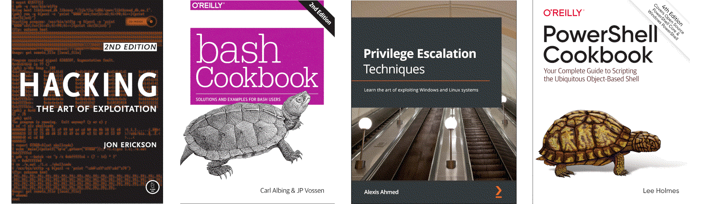

Smithing
===========================================================

While exploitation and privilege escalation is not the end goal, it is a key element of the attack life cycle and a major determinant in the success of a penetration test.

.. image:: _static/images/in-progress.png
  :alt: Forever in progress ...

----

.. toctree::
   :maxdepth: 1
   :includehidden:
   :caption: Testlab

   Virtual machines <https://testlab.tymyrddin.dev/docs/vm/README>
   Assemblers <https://testlab.tymyrddin.dev/docs/asm/README>
   Compilers <https://testlab.tymyrddin.dev/docs/com/README>
   Disassemblers <https://testlab.tymyrddin.dev/docs/dis/README>
   Debuggers <https://testlab.tymyrddin.dev/docs/deb/README>
   Decompilers <https://testlab.tymyrddin.dev/docs/dec/README>
   Exploit development <https://testlab.tymyrddin.dev/docs/edt/README>
   Exploitation tools <https://testlab.tymyrddin.dev/docs/exploitation/README>

----

.. toctree::
   :maxdepth: 1
   :includehidden:
   :caption: Notes on techniques

   docs/notes/README.md
   docs/notes/common.md
   docs/notes/infrastructure.md
   docs/notes/shells.md

.. toctree::
   :maxdepth: 1
   :includehidden:
   :caption: Linux

   docs/linux/README.md
   docs/linux/escalation.md
   docs/linux/kernel.md
   docs/linux/sudo.md
   docs/linux/suid.md
   docs/linux/capabilities.md
   docs/linux/cron.md
   docs/linux/path.md
   docs/linux/nfs.md
   docs/linux/shellcode.md

.. toctree::
   :maxdepth: 1
   :includehidden:
   :caption: Windows

   docs/windows/README.md
   docs/windows/escalation.md
   docs/windows/passwords.md
   docs/windows/quick.md
   docs/windows/services.md
   docs/windows/privileges.md
   docs/windows/software.md
   docs/windows/shellcode.md

----

Coding for better understanding of concepts, and for some hands-on. **Malware included.**

.. toctree::
   :maxdepth: 1
   :includehidden:
   :caption: Coding shells and exploits

   Basic TCP reverse shell <https://github.com/tymyrddin/codes-exploits/tree/main/tcp-reverse-shell>
   Execute system commands <https://github.com/tymyrddin/codes-exploits/tree/main/execute_commands>
   Keylogger <https://github.com/tymyrddin/codes-exploits/tree/main/keylogger>
   Backdoor <https://github.com/tymyrddin/codes-exploits/tree/main/backdoor>
   Bypasses <https://github.com/tymyrddin/codes-exploits/tree/main/bypasses>

----

.. toctree::
   :maxdepth: 1
   :includehidden:
   :caption: TryHackMe rooms

   docs/thm/README.md
   docs/thm/win-privesc.md
   docs/thm/linux-privesc.md
   docs/thm/steel-mountain.md
   docs/thm/alfred.md
   docs/thm/hackpark.md
   docs/thm/game-zone.md
   docs/thm/skynet.md
   docs/thm/bugle.md
   docs/thm/overpass2.md
   docs/thm/relevant.md
   docs/thm/internal.md
   docs/thm/mr-robot.md

----

.. toctree::
   :glob:
   :maxdepth: 1
   :includehidden:
   :caption: Root-me app-script challenges

   docs/root-me/README.md
   docs/root-me/bash1.md
   docs/root-me/sudo-weak-config.md
   docs/root-me/bash2.md
   docs/root-me/latex.md
   docs/root-me/powershell-cmd-injection.md
   docs/root-me/bash-unquoted-exp.md
   docs/root-me/perl-cmd-injection.md
   docs/root-me/bash-cron.md
   docs/root-me/python-input.md
   docs/root-me/python-pickle.md

----

